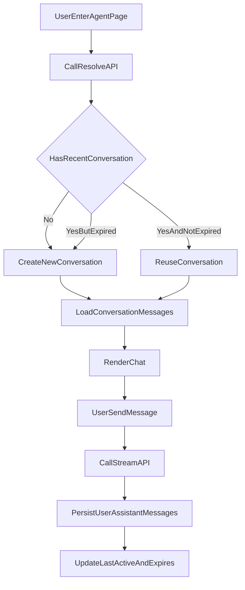

# AI-Agent 会话记忆设计方案

## 目标与成功标准
- 用户再次进入同一 Agent 页面时，可看到“最近一次未过期会话”的完整消息。
- 若最近会话距最后活跃时间超过24小时，则自动创建新会话。
- 即使会话未过期，用户也可以手动点击“新对话”创建新会话。
- 消息发送后可持久化到服务端，刷新页面不丢失。

## 现状（基于当前代码）
- 前端消息状态仅保存在 `useState`，未持久化：[AssistantClient.tsx](/Users/chenzhanpeng/Desktop/code/ai-Agent/next-project/app/assistant/AssistantClient.tsx)
- 前端当前只调用流式接口 `/chat/stream`，没有会话管理 API：[AssistantClient.tsx](/Users/chenzhanpeng/Desktop/code/ai-Agent/next-project/app/assistant/AssistantClient.tsx)
- 后端仅有流式聊天路由，无历史会话模型：[routes.py](/Users/chenzhanpeng/Desktop/code/ai-Agent/mcp_server/server/chat/routes.py)
- 项目已有 sqlite 落地模式可复用（路径、建表、upsert风格）：[xhs_note_cache.py](/Users/chenzhanpeng/Desktop/code/ai-Agent/mcp_server/server/xhs/xhs_note_cache.py)

## 设计决策
- **会话归属**：按登录用户ID（`user_id`）隔离。
- **过期策略**：按“最后活跃时间”计算，`last_active_at + 24h` 过期。
- **最小侵入**：保留现有 `/chat/stream` 主流程，新加会话 API；前端在发送前后串接会话读写。

## 数据模型（SQLite）
- 新增数据库文件（建议）：`mcp_server/data/chat_memory.db`
- 新增表：
  - `chat_conversations`
    - `id TEXT PRIMARY KEY`
    - `user_id TEXT NOT NULL`
    - `agent TEXT NOT NULL`
    - `title TEXT NOT NULL DEFAULT ''`
    - `status TEXT NOT NULL DEFAULT 'active'`（可扩展 archived）
    - `last_active_at TEXT NOT NULL`
    - `expires_at TEXT NOT NULL`
    - `created_at TEXT NOT NULL`
    - `updated_at TEXT NOT NULL`
  - `chat_messages`
    - `id TEXT PRIMARY KEY`
    - `conversation_id TEXT NOT NULL`
    - `role TEXT NOT NULL`（user/assistant/system）
    - `content TEXT NOT NULL`
    - `meta_json TEXT NOT NULL DEFAULT '{}'`（references/search_meta）
    - `created_at TEXT NOT NULL`
- 索引：
  - `idx_conv_user_agent_active` on `(user_id, agent, status, last_active_at DESC)`
  - `idx_msg_conv_created` on `(conversation_id, created_at ASC)`

## API 设计（FastAPI）
在 `mcp_server/server/chat/routes.py` 增加以下接口（可拆到 `memory_routes.py` 后再 include）：

- `POST /chat/conversations/resolve`
  - 入参：`user_id`, `agent`, `force_new?: boolean`
  - 逻辑：
    - 若 `force_new=true`：总是创建新会话。
    - 否则查最近活跃会话；若未过期返回该会话，否则新建会话。
  - 出参：`conversation`（含 `is_new`, `is_expired_replaced`）。

- `GET /chat/conversations/{conversation_id}/messages`
  - 返回会话消息列表（按时间升序）。

- `POST /chat/conversations/{conversation_id}/messages`
  - 入参：`messages: [{role, content, meta?}]`（支持批量写入 user+assistant）
  - 写入后更新会话：
    - `last_active_at = now`
    - `expires_at = now + 24h`
    - `updated_at = now`

- `GET /chat/conversations`
  - 入参：`user_id`, `agent`, `limit`
  - 用于后续“历史会话列表”扩展；首版可先显示最近若干条。

## 前端交互方案（Next.js）
主要修改：[AssistantClient.tsx](/Users/chenzhanpeng/Desktop/code/ai-Agent/next-project/app/assistant/AssistantClient.tsx)

- 页面初始化：
  1. 调 `resolve(force_new=false)` 获取当前会话。
  2. 拉取该会话消息并渲染到 `messages`。
- 新对话入口：
  - 在顶部 header 增加“新对话”按钮。
  - 点击后调 `resolve(force_new=true)`，并清空当前消息区后加载新会话。
- 发送消息流程：
  1. 本地先追加 user message（现有逻辑保留）。
  2. 流式回复结束后，将 user+assistant 一起 `POST /messages` 持久化。
  3. 持久化失败时给轻提示，但不阻断当前 UI。
- Agent 切换行为：
  - 切换到新 agent 时各自调用 `resolve`，每个 agent 维护独立最近会话。

## 关键流程图

## 增量实施步骤（小步上线）
1. 后端新增 sqlite memory 模块（建表、CRUD、过期判断）
2. 后端新增 `resolve` + `messages` 接口并自测
3. 前端接入初始化恢复会话
4. 前端新增“新对话”按钮与 `force_new`
5. 前端在回复完成后持久化消息
6. 增加基础回归：刷新恢复、24h过期新建、未过期主动新建

## 验证清单
- 同一用户在24h内重新进入：看到上次消息。
- 超过24h再进入：自动空白新会话（旧会话仍可在历史列表中保留）。
- 未过期时点“新对话”：立即创建新会话并开始新的消息链。
- 流式聊天正常，不因会话接口失败导致主聊天不可用。

## 后续可选扩展（不纳入首版）
- 会话标题自动生成（首条用户消息摘要）。
- 历史会话侧边栏（切换旧会话）。
- 会话软删除/归档。
- 定时清理长期过期数据。